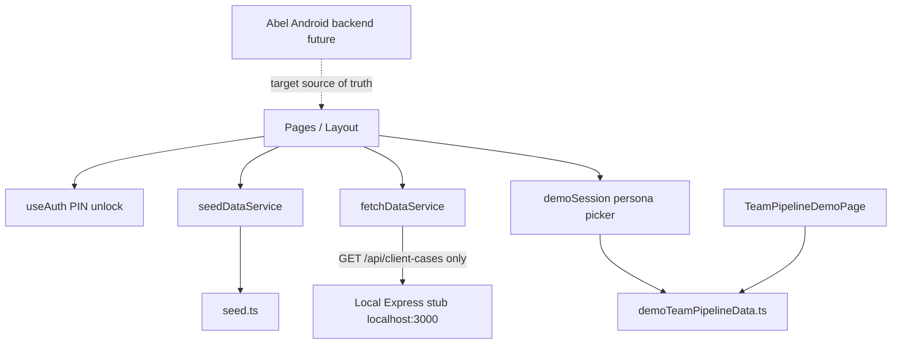

# API Integration Preparation Plan

Date: 11 August 2026  
Status: waiting for Abel’s Android backend documentation  
Rule: documentation only — no coding, no UI changes, no demo removal, no production connection

## Purpose

Prepare the AdvisorTrack frontend so that once Abel provides the Android backend API details, we know exactly where to plug in:

- login
- current user profile
- subscription status
- team leader data
- regional manager data
- senior management data
- advisor pipeline
- production data

Hard constraints:

- The web dashboard must use Abel’s Android backend **100%**.
- The web dashboard must **not** have its own production backend.
- Keep the approved UI untouched.
- Keep the seeded Team Pipeline demo in place for now.

---

## 1. Current frontend data flow



### How data reaches the UI today

1. Most pages import `seedDataService as db` and call methods like `db.getAdvisors()`.
2. `seedDataService` reads in-memory arrays from `src/data/seed.ts`.
3. `ProductionPage` is the only hybrid page: production cases come from `fetchDataService`, advisors still come from seed.
4. `/team-pipeline-demo` is fully isolated and uses `demoTeamPipelineData.ts` + `demoSession.ts`.
5. Login is a local PIN unlock via `useAuth`, not Abel credentials.
6. The intended long-term seam is already documented in `src/data/DataService.ts`.

### Important existing seam

`src/data/DataService.ts` already says the UI should not change when Abel’s API arrives.  
That interface is the right conceptual swap point, but for Abel integration we should add a clearer API module layer under `src/api/` and have a future Abel-backed `DataService` call those modules.

---

## 2. Every place currently using seeded or demo data

### A. Main admin console pages using `seedDataService`

| File | Seed usage |
| --- | --- |
| `src/pages/DashboardPage.tsx` | advisors, subscriptions, production cases, weekly activity, support tickets |
| `src/pages/AdvisorsPage.tsx` | advisors list |
| `src/pages/AdvisorDetailPage.tsx` | advisor, cases, activity, subscriptions |
| `src/pages/SubscriptionsPage.tsx` | subscriptions |
| `src/pages/CompaniesPage.tsx` | companies |
| `src/pages/InvoicesPage.tsx` | invoices |
| `src/pages/SupportPage.tsx` | support tickets + direct `users` from seed |
| `src/pages/ReportsPage.tsx` | monthly revenue, subscriptions, companies |
| `src/pages/UsersPage.tsx` | managed users |
| `src/pages/SettingsPage.tsx` | current user / founders via seed service |

### B. Hybrid live + seed

| File | Live | Seed |
| --- | --- | --- |
| `src/pages/ProductionPage.tsx` | `fetchDataService.getProductionCases()` → local `/api/client-cases` | `db.getAdvisors()` |

### C. Layout / auth / demo

| File | Current source |
| --- | --- |
| `src/components/Layout.tsx` | `users[0]` and `supportTickets` from `seed.ts`; demo profile from `demoSession` on demo route |
| `src/lib/useAuth.ts` | local PIN / `sessionStorage.at_auth` |
| `src/pages/LoginPage.tsx` | PIN UI only |
| `src/lib/demoSession.ts` | demo persona id in `sessionStorage` |
| `src/pages/TeamPipelineDemoPage.tsx` | fully seeded demo dataset |
| `src/data/demoTeamPipelineData.ts` | demo companies, teams, personas, advisors, clients |

### D. Seed providers

| File | Role |
| --- | --- |
| `src/data/seed.ts` | raw seeded arrays |
| `src/data/seedDataService.ts` | `DataService` implementation over seed |
| `src/data/fetchDataService.ts` | partial live adapter for production cases only |
| `src/data/DataService.ts` | interface the UI should keep using |

---

## 3. Where the future API service layer should live

Recommended home:

```text
AdvisorTrack Frontend/src/api/
  client.ts              # shared fetch + base URL + auth header helper
  authApi.ts
  dashboardApi.ts
  pipelineApi.ts
  productionApi.ts
  subscriptionApi.ts
  types.ts               # Abel response DTOs if needed
```

Then keep the existing UI-facing seam:

```text
AdvisorTrack Frontend/src/data/
  DataService.ts         # keep unchanged conceptually
  abelDataService.ts     # future implementation calling src/api/*
  seedDataService.ts     # keep for fallback / local UI work
  fetchDataService.ts    # temporary local stub adapter; retire after Abel wiring
```

### Why this structure

- Pages keep calling a `DataService`-shaped provider, so UI stays untouched.
- Abel-specific HTTP details stay in `src/api/`, not scattered across pages.
- The demo route can remain on seeded data while production pages move to Abel.
- The local Express stub is temporary and must not become a production backend.

---

## 4. Recommended API module structure

### `authApi`

Responsibility:

- login with the same credentials as Android
- fetch current user / session profile
- logout / clear token
- expose role and allowed scope

Plug-in targets in UI:

- replace PIN unlock path in `useAuth` / login flow later
- feed current user into `Layout` profile
- gate routes by role/subscription

### `dashboardApi`

Responsibility:

- company / region / team summaries for:
  - Team Leader
  - Regional Manager
  - Senior Management
  - Founder/Admin
- advisor status aggregates
- stuck cases / active this week / pipeline totals

Plug-in targets:

- `DashboardPage`
- leadership overview sections currently mocked by seed or demo

### `pipelineApi`

Responsibility:

- advisor cards
- advisor detail / drawer pipeline
- client cases by advisor/team/region/company
- next actions, FICA/status fields if provided by Abel

Plug-in targets:

- `AdvisorsPage`
- `AdvisorDetailPage`
- future production Team Pipeline view (not the seeded demo page yet)

### `productionApi`

Responsibility:

- submitted vs issued cases
- commission totals
- production tables/charts

Plug-in targets:

- `ProductionPage`
- dashboard production KPIs

### `subscriptionApi`

Responsibility:

- subscription status for the logged-in user
- subscription lists / eligibility for web access
- company license pool data if Abel exposes it

Plug-in targets:

- post-login access gate
- `SubscriptionsPage`
- dashboard subscriber KPIs

### Shared `client.ts`

Must centralize:

- Abel API base URL
- auth token attachment
- common error handling (`401`, `403`, network failure)
- JSON parsing

Do **not** hardcode Abel credentials into pages.

---

## 5. What each API module needs from Abel tomorrow

### Needed by all modules

- staging/production API base URL
- auth scheme: Bearer JWT, cookie, or other
- exact error codes for invalid login, expired session, unsubscribed, forbidden role
- CORS allowance for `app.advisortrack.co.za` and local Vite origin

### `authApi` needs

- login endpoint path
- request body fields (email/password or other)
- response fields:
  - token/session
  - user id
  - display name
  - role
  - company id
  - region id if any
  - team id if any
  - advisor id if any
  - subscription valid flag or equivalent
- `/me` endpoint if profile/scope are not fully in login response

### `subscriptionApi` needs

- how subscription validity is represented
- whether status is on the user, a subscriptions table, or both
- values that mean “allowed on web”
- endpoint to list or verify subscriptions

### `dashboardApi` needs

- endpoints or query params for scoped summaries by:
  - team
  - region
  - company
  - all companies
- fields needed for KPIs already shown in the approved UI

### `pipelineApi` needs

- advisors list endpoint
- advisor detail endpoint
- client/pipeline cases endpoint
- team assignment fields
- region assignment fields if Regional Manager exists
- stuck / stage / next action / commission fields

### `productionApi` needs

- production/case endpoint
- status mapping for submitted vs issued
- commission fields
- advisor linkage field (`user_id` / `advisor_id`)

### Role mapping Abel must clarify

| Launch role | Current frontend stub names | What Abel must confirm |
| --- | --- | --- |
| Founder/Admin | `SuperAdmin` | exact production role value |
| Senior Management | closest stub: `CompanyAdmin` | exact production role value + company scope |
| Regional Manager | **no existing model** | whether region exists and how it is scoped |
| Team Leader | closest stub: `TeamManager` | exact production role value + team scope |
| Advisor | `Advisor` | Android-only for launch; confirm web deny/allow |

---

## 6. Which parts of the UI must stay untouched

Do not redesign or remove:

- approved dashboard layout and visual style
- existing page structure and routes for the main console
- Team Pipeline demo page and demo route
- demo persona login screen
- current card/drawer presentation patterns already approved for demos

Allowed later, after Abel’s docs, and only as wiring:

- replace PIN auth with Abel login behind the existing login screen shape if possible
- swap data providers from seed to Abel-backed services
- hide/show pages by Abel role/subscription without redesigning them

Explicitly do **not**:

- invent a second production backend for the web
- rewrite pages around a new data model unless Abel’s payloads force a thin adapter
- delete demo code while launch integration is incomplete

---

## 7. Safest first integration step once Abel sends the backend docs

Do this first, and only this first:

1. Document Abel’s exact login + `/me` + subscription fields against this prep list.
2. Add a thin `src/api/client.ts` + `authApi.ts` that can call Abel’s login/`me` in a local/staging environment.
3. Replace the PIN unlock with Abel login **only after** auth responses are verified.
4. Gate the app on:
   - valid Abel session
   - valid subscription
   - allowed web role
5. Wire one read-only page next, preferably `ProductionPage` or Advisors list, using Abel data through an adapter.
6. Keep `/team-pipeline-demo` on seeded data until the live Team Pipeline path is proven.

Do **not** start by rebuilding the dashboard UI.  
Do **not** point the whole app at Abel until login, subscription, and one scoped read path are confirmed.

---

## 8. Plug-in map: where Abel data will replace seed/demo

| Need | Current source | Future Abel plug-in |
| --- | --- | --- |
| Login | `useAuth` PIN | `authApi.login` |
| Current user profile | `seed.ts` users / `getCurrentUser()` | `authApi.me` |
| Subscription status | seed subscriptions | `subscriptionApi` + auth payload |
| Team Leader data | seed teams/advisors or demo personas | `dashboardApi` + `pipelineApi` scoped by team |
| Regional Manager data | not modeled | `dashboardApi` + region fields from Abel |
| Senior Management data | seed company-wide views | `dashboardApi` scoped by company |
| Advisor pipeline | seed / demo pipeline | `pipelineApi` |
| Production data | local `/api/client-cases` + seed advisors | `productionApi` + Abel advisors |

---

## 9. What remains temporary until Abel docs arrive

Safe to keep as-is:

- `seedDataService`
- `/team-pipeline-demo`
- local Express stub for local experiments
- current PIN gate for non-demo routes

Must not become production architecture:

- local Express as the web’s long-term backend
- PIN unlock as real authentication
- demo persona session as real RBAC

---

## 10. Checklist for tomorrow’s Abel review

Ask Abel to confirm:

1. API base URL for staging and production
2. Login endpoint + request body
3. Token/session format and how to send it
4. `/me` or equivalent profile endpoint
5. Subscription validity field/endpoint
6. Role values and scope fields for Team Leader, Regional Manager, Senior Management, Founder/Admin
7. Advisors endpoint
8. Teams / companies / regions endpoints
9. Client cases / pipeline endpoint
10. Activities / production endpoint
11. CORS origins for web
12. Whether web should be read-only at launch

Once those answers exist, implementation can start from `authApi` without touching the approved UI or removing the demo.

---

## Related docs

- `docs/ANDROID_BACKEND_DISCOVERY.md`
- `docs/ANDROID_WEB_SYNC_PLAN.md`
- `docs/BACKEND_API_REQUIREMENTS.md`
- `docs/ROLE_VISIBILITY_MATRIX.md`
- `docs/PRODUCTION_LAUNCH_TODO.md`
- `AdvisorTrack Backend/docs/SAFE_NEXT_STEPS.md`
- `AdvisorTrack Backend/docs/MISSING_ENDPOINTS.md`

## Bottom line

The frontend already has a clean swap point through `DataService`, but almost every page still reads seed data. The safest preparation is to plan a dedicated `src/api/` layer for Abel, keep the UI and demo untouched, and make Abel login + subscription + one scoped read the first real integration after the docs arrive.